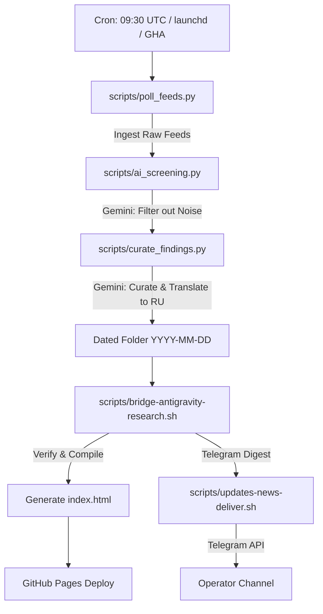

# Technical Handover: Stack Watch Automated News Curation Pipeline

**Author:** AntiGravity Agent  
**Recipient:** External AI Agent / Operator  
**Workspace Root:** [/Users/user/Projects/Stack Watch/](file:///Users/user/Projects/Stack%20Watch/)  
**Status:** Pipeline fully migrated, verified, and ready for deployment.

---

## 📋 Context & Project Objective
The Stack Watch pipeline is an automated tool intelligence scanner that monitors **26 tech stack components** for updates, releases, features, and regressions. It runs daily, pre-screens raw feeds, curates summaries, matches them against rubrics and historical learnings, and outputs curated findings in Russian for a downstream Telegram delivery agent (Hermes).

The primary goal of this iteration was to **migrate the pipeline from a local macOS host dependency to a host-independent, cloud-ready execution model** using **GitHub Actions**, while ensuring resiliency against API rate limits and quotas under the **Google Gemini Free Tier**.

---

## 🛠️ Completed Work Summary

### 1. Unified and Cleaned Workspace
- Consolidated all files under the single, authoritative project root: `/Users/user/Projects/Stack Watch/`.
- The duplicate `/Users/user/Projects/Research/` folder was completely removed to prevent confusion.
- Added a proper `.gitignore` (ignoring runtime logs, backups, and temporary caches) and initialized a clean git repository.

### 2. Path Decoupling & Host Independence
- Refactored `poll_feeds.py` and `ai_screening.py` to dynamically resolve `WORKSPACE_DIR` relative to the script location:
  `WORKSPACE_DIR = os.path.dirname(os.path.dirname(os.path.abspath(__file__)))`
- Environment-agnostic log directory resolution: Scripts log to `/Users/user/Library/Logs/` on macOS, falling back automatically to the project directory `./logs/` when running in GitHub Actions (Linux container).
- Removed platform-specific macOS Keychain dependencies from `ai_screening.py` when running on non-macOS systems (e.g., Linux CI), falling back to standard environment variables.

### 3. Gemini Free-Tier Resilience & Configuration
- **Model Quota Bypass:** Solved a critical quota block (HTTP 429 quota error: `limit: 0` for `gemini-2.0-flash-lite`/`gemini-2.0-flash`) by routing API calls to the stable alias **`gemini-flash-latest`** (which points to Gemini 1.5 Flash). This model has active free-tier quota in all regions.
- **Rate Limit Retries:** Implemented a robust 3-attempt retry loop with exponential backoff (`time.sleep`) in `ai_screening.py` and `curate_findings.py` to handle frequent HTTP 429 rate limits.
- **Fail-Open Fallback:** If the Gemini API remains completely unreachable or returns errors after all retries, the screening script falls back to a fail-open mode, keeping all feeds to avoid silent data loss. Removed legacy/unsupported fallbacks (DeepSeek, Kimi, local Ollama).

### 4. Feed Retrieval Resiliency
- Refactored `poll_feeds.py` to wrap each external feed fetch (GitHub releases, HN discussions) in isolated `try-except` blocks.
- If a single feed times out or fails (e.g., due to network issues), it is logged and bypassed, ensuring the rest of the daily run completes successfully rather than crashing the pipeline.

### 5. Created Autonomous Curation Agent (`curate_findings.py`)
- Built a brand new, fully autonomous curation script ([curate_findings.py](file:///Users/user/Projects/Stack%20Watch/scripts/curate_findings.py)).
- Reads daily feed updates, filters out skipped items according to historical seen URLs and `_rubric.md` definitions, and constructs a structured system prompt including rules from `learnings.md`.
- Utilizes Gemini's structured JSON output mode to guarantee deterministic formatting and curates all 7 daily deliverables: `summary.md`, `REPORT.md`, findings under `external-research/`, and memory entries under `memory-entries/`.

### 6. GitHub Actions CI/CD Pipeline
- Designed and verified [.github/workflows/stack-watch-pipeline.yml](file:///Users/user/Projects/Stack%20Watch/.github/workflows/stack-watch-pipeline.yml).
- **Execution Schedule:** Triggers automatically at **09:30 UTC** daily (or on manual repository dispatch).
- **Pipeline Flow:**
  1. Sets up Python, installs dependencies (`requests`, `google-generativeai`).
  2. Runs ingestion, screening, and autonomous curation.
  3. Executes `bridge-antigravity-research.sh` to update index databases, archive logs, and compile weeklies.
  4. Commits runtime state changes (such as deduplication caches `seen_releases.json`, `_seen-urls.txt`, and generated indices) back to the repository.
  5. Compiles and deploys the static dashboard `index.html` directly to **GitHub Pages** (via the `gh-pages` branch).

### 7. Decommissioned Local Gateway Daemon
- Unloaded and disabled the local background launchd daemon `com.user.stack-watch-gateway` since interactive Slack/Telegram gateway buttons are currently unsupported.
- Kept the configuration plist file for archiving/reference under `launchd/`.

---

## 📐 Pipeline Architecture & Data Flow



---

## 📂 Codebase & Component Map

- **Ingestion & Screening:**
  - [poll_feeds.py](file:///Users/user/Projects/Stack%20Watch/scripts/poll_feeds.py) - Polls and stores raw feeds.
  - [ai_screening.py](file:///Users/user/Projects/Stack%20Watch/scripts/ai_screening.py) - Clears noise using Gemini.
  - [run_poller_and_screening.sh](file:///Users/user/Projects/Stack%20Watch/scripts/run_poller_and_screening.sh) - Helper bash script chaining poller and screening.
- **Knowledge Base & Rubrics:**
  - [_rubric.md](file:///Users/user/Projects/Stack%20Watch/_rubric.md) - Tech stack description and verdict rubrics.
  - [learnings.md](file:///Users/user/Projects/Stack%20Watch/learnings.md) - Project context, lessons, and exceptions.
- **Autonomous Curation:**
  - [curate_findings.py](file:///Users/user/Projects/Stack%20Watch/scripts/curate_findings.py) - Main AI agent parsing and generating formatted files.
- **Database & State:**
  - `_seen-urls.txt` - Registry of already processed article links.
  - `seen_releases.json` - Registry of processed GitHub tags.
- **Dashboard & Static Site:**
  - [generate_dashboard.py](file:///Users/user/Projects/Stack%20Watch/scripts/generate_dashboard.py) - Compiles static indices.
  - [index.html](file:///Users/user/Projects/Stack%20Watch/index.html) - Premium responsive dashboard interface.
- **Automation Configuration:**
  - [.github/workflows/stack-watch-pipeline.yml](file:///Users/user/Projects/Stack%20Watch/.github/workflows/stack-watch-pipeline.yml) - GitHub Actions configuration.
  - [launchd/](file:///Users/user/Projects/Stack%20Watch/launchd/) - Directory containing native macOS launchd XML plists.

---

## ⚙️ macOS launchd Configuration
If you run the pipeline locally on a Mac host, the schedule is controlled by these LaunchAgents:

| Plist Name | Active Path | Schedule | Executed Script |
|---|---|---|---|
| **`com.user.poll-feeds-research`** | `~/Library/LaunchAgents/com.user.poll-feeds-research.plist` | Daily **09:30** | `run_poller_and_screening.sh` |
| **`com.user.bridge-antigravity-research`** | `~/Library/LaunchAgents/com.user.bridge-antigravity-research.plist` | Daily **10:00** | `bridge-antigravity-research.sh` |

*Note: The local gateway daemon (`com.user.stack-watch-gateway`) has been decommissioned.*

---

## 🛠️ Operational Diagnostics

### Log Locations (Local macOS Run)
- **Ingestion/Screening Log:** `/Users/user/Library/Logs/poll-feeds-research.stdout.log`
- **Bridge Processing Log:** `/Users/user/Library/Logs/bridge-antigravity-research.log`
- **Curation Log:** `/Users/user/Projects/Stack Watch/curate-findings.log`

### Quick Action Commands
- **Run local ingestion & screening manually:**
  ```bash
  /Users/user/Projects/Stack\ Watch/scripts/run_poller_and_screening.sh
  ```
- **Run curation manually:**
  ```bash
  python3 /Users/user/Projects/Stack\ Watch/scripts/curate_findings.py
  ```
- **Process a custom dated run (e.g. `2026-06-06`):**
  ```bash
  /Users/user/Projects/Stack\ Watch/scripts/bridge-antigravity-research.sh 2026-06-06
  ```
- **Force rebuild the index dashboard:**
  ```bash
  python3 /Users/user/Projects/Stack\ Watch/scripts/generate_dashboard.py
  ```

---

## 🚀 Future Integration Tasks (Next-Agent Action Items)

To complete the cloud migration, the downstream agent or operator must perform the following actions:

1. **Configure Git Remote & Push Code:**
   Create a target GitHub repository, link the local git repository, and push:
   ```bash
   git remote add origin <your-github-repo-url>
   git branch -M main
   git push -u origin main
   ```
2. **Add GitHub Actions Secrets:**
   In your repository Settings > Secrets > Actions, add:
   - `GEMINI_API_KEY` (Free tier key from Google AI Studio)
   - `TELEGRAM_TOKEN_UPDATES` (Bot API token)
   - `TELEGRAM_CHAT_ID` (Destination channel ID)
3. **Configure Pages deployment:**
   Once the GitHub Action completes its initial run, go to Settings > Pages and configure the deployment source to deploy from the `gh-pages` branch.
