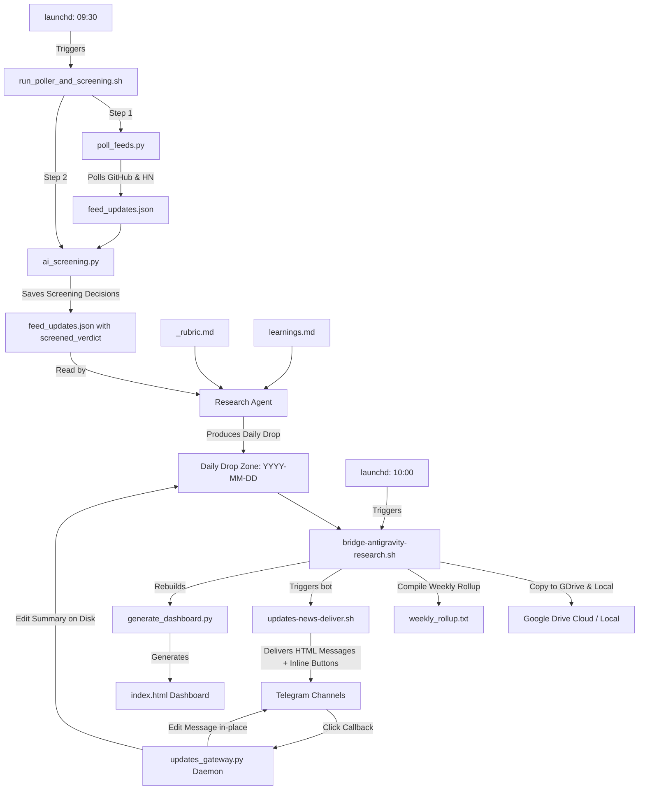

# Technical Handoff Report: Stack Watch News Pipeline & Advanced Features

**Date:** 2026-06-06  
**Author:** AntiGravity Agent  
**Audience:** External Developer Agents / Operators  
**Workspace Base:** `/Users/user/Projects/Stack Watch`  
**Status:** **FULLY DEPLOYED, CONFIGURED, AND PRODUCTION-READY**

---

## 1. System Architecture & Flow

The Stack Watch system is an automated news aggregation, screening, processing, delivery, and visualization pipeline. It operates on a daily cycle via launchd daemons on macOS.



---

## 2. Completed Phase Breakdown

### Phase 0: Reliability & Quick Wins
* **Retry Loop**: Upgraded `updates-news-deliver.sh` to include a 3-attempt retry loop with exponential backoff (`sleep $((10 * attempt))` seconds) for robust Telegram message delivery.
* **Orphan Cleanup**: Embedded auto-pruning in the bridge script. It automatically identifies and removes drop directories older than 3 days that lack `REPORT.md` (incomplete runs), preventing disk bloat.
* **Deprecation**: Cleaned up legacy OpenClaw notification formats.

### Phase 1 & 2: Automated Ingestion & Prioritization
* **Ingestion Poller**: Written [poll_feeds.py](file:///Users/user/Projects/Stack%20Watch/scripts/poll_feeds.py) fetching from:
  - GitHub Atom Releases (Ollama, Claude Code, Mem0, tmux, iTerm2, OpenClaw).
  - GitHub Atom Commits (Desktop Commander MCP registry).
  - HN Search API via Algolia keywords (Ollama, Claude Code, NotebookLM, Wispr Flow, Mem0).
* **Prioritization Rubric**: Configured [_rubric.md](file:///Users/user/Projects/Stack%20Watch/_rubric.md) to force outputting metadata such as `Severity` tags (`critical/breaking`, `normal/feature`, `low/maintenance`, `skip/minor`) and explicit component mapping.
* **Breaking-marker**: If `critical/breaking` items are found, the agent writes a `breaking-marker` file.

### Phase 3 & 4: Delivery Format, Routing & Weekly Rollup
* **Dual Routing Channel**:
  - **Immediate Alerts**: If the bridge finds a `breaking-marker` file, it immediately runs the bot with `--immediate` to alert the operator.
  - **Regular Digests**: Standard findings are routed to the normal channel.
* **Weekly Rollup**: Bridge implements `--weekly` which compiles a Markdown summary of findings from the last 7 days.
* **Telegram Features**: Implemented 4096-character auto-chunking, TL;DR headers with stats, component-to-layer grouping, severity emojis, and auto-attachment of detailed reports via `sendDocument` API.

---

## 3. Advanced Features (Phase 6)

### Task 1: Telegram Callback Gateway (Interactive Bot Response)
* **Script**: [updates_gateway.py](file:///Users/user/Projects/Stack%20Watch/scripts/updates_gateway.py)
* **Behavior**: Implements a webhook-less HTTPS polling daemon (`getUpdates`) fetching callback responses.
* **Actions**:
  - `park:<slug>`: Appends/moves the finding item in `summary.md` on disk to the `## Parking` section.
  - `skip:<slug>`: Removes or moves the item to `## Skipped`.
  - `do_now:<slug>`: Moves the item to `## Do now (high confidence)`.
  - **In-place Edit**: Triggers the `editMessageText` API to update the inline keyboard and text on Telegram showing the modified state (e.g. `[🅿️ Parked]`).
* **Daemon plist**: Located in the repository at `/Users/user/Projects/Stack Watch/launchd/com.user.stack-watch-gateway.plist`. **Status: Decommissioned/Unloaded** by operator policy because the Hermes delivery bot does not yet emit inline keyboard buttons. It has been unloaded and removed from `~/Library/LaunchAgents/` to avoid unnecessary background operations until keyboard support is added on the delivery side.

### Task 2: Self-Improving Rubric (Reinforcement Loop)
* **Learnings DB**: [learnings.md](file:///Users/user/Projects/Stack%20Watch/learnings.md)
* **Loop**: Contains human correction rules. The Research Agent is instructed in `_rubric.md` to load and apply these exceptions first before evaluating any feeds.

### Task 3: rclone Google Drive Direct Sync
* **Location**: Integrated inside [bridge-antigravity-research.sh](file:///Users/user/Projects/Stack%20Watch/scripts/bridge-antigravity-research.sh).
* **Functionality**: Proactively checks for `rclone` binary and config remote `gdrive:`. If found, performs a cloud sync of the entire compiled knowledge base folder. If missing, logs a warning and falls back to local client sync folder (`~/My Drive/Stack Watch/...`).

### Task 4: Preliminary AI Screening
* **Script**: [ai_screening.py](file:///Users/user/Projects/Stack%20Watch/scripts/ai_screening.py)
* **Logic**: Intercepts `feed_updates.json` between feed ingestion and agent execution. Evaluates candidates against the 26 watchlist components and out-of-scope rubrics using a fast model.
* **Model**: Calls `gemini-2.0-flash-lite` exclusively. All other model integrations (DeepSeek, Kimi, Ollama) have been completely removed per operator policy.
* **Fallback**: If the Gemini API key is missing or the call fails, the script falls back to a fail-open default that marks all candidates as `keep` with the reason `"Gemini unavailable — kept by default"`.
* **Output**: Writes `"screened_verdict": "keep" | "skip"` and a Russian explanation reason directly inside `feed_updates.json`.

### Task 5: Static HTML Dashboard
* **Script**: [generate_dashboard.py](file:///Users/user/Projects/Stack%20Watch/scripts/generate_dashboard.py)
* **Result**: Root [index.html](file:///Users/user/Projects/Stack%20Watch/index.html)
* **UI Features**: Premium, dark-mode single page dashboard. Houses a date sidebar of historical runs, a live agent status indicator, reactive stats cards (Total Candidates, Actionable Findings, Validation Rate), filter tabs (All/Do Now/Experiment/Parking/Skipped), and search field. Includes tabs to review the learnings log and standard system rubrics.
* **Integration**: Automatically triggered at the end of the bridge run.

---

## 4. Key Configurations & launchd Daemons

The system uses three macOS launchd plists (located in [launchd/](file:///Users/user/Projects/Stack%20Watch/launchd/)):

1. **`com.user.poll-feeds-research`**
   - **Path**: `/Users/user/Library/LaunchAgents/com.user.poll-feeds-research.plist`
   - **Trigger**: Daily at **09:30**.
   - **Executes**: `/Users/user/Projects/Stack Watch/scripts/run_poller_and_screening.sh` (chains poller and AI screening).
2. **`com.user.bridge-antigravity-research`**
   - **Path**: `/Users/user/Library/LaunchAgents/com.user.bridge-antigravity-research.plist`
   - **Trigger**: Daily at **10:00**.
   - **Executes**: `/Users/user/Projects/Stack Watch/scripts/bridge-antigravity-research.sh` (processes drop, rolls up archives, triggers Telegram digest, and rebuilds dashboard).
3. **`com.user.stack-watch-gateway`** (Decommissioned)
   - **Status**: **Unloaded & Stopped** (plist removed from `~/Library/LaunchAgents/`).
   - **Reference Path**: `/Users/user/Projects/Stack Watch/launchd/com.user.stack-watch-gateway.plist` (stored in workspace for future activation once delivery bot keyboard support is completed).

---

## 5. Maintenance & Diagnostics Command Sheet

### Manual Testing
To run feed ingestion and AI screening manually:
```bash
/Users/user/Projects/Stack\ Watch/scripts/run_poller_and_screening.sh
```

To run the bridge manually (e.g., to process a daily folder named `2026-06-06`):
```bash
/Users/user/Projects/Stack\ Watch/scripts/bridge-antigravity-research.sh 2026-06-06
```

To compile a weekly rollup:
```bash
/Users/user/Projects/Stack\ Watch/scripts/bridge-antigravity-research.sh --weekly
```

To manually trigger dashboard reconstruction:
```bash
python3 /Users/user/Projects/Stack\ Watch/scripts/generate_dashboard.py
```

### Log Infiltration
* **Feed Poller & Screening Logs**:
  `tail -f /Users/user/Library/Logs/poll-feeds-research.stdout.log`
  `tail -f /Users/user/Library/Logs/poll-feeds-research.stderr.log`
* **Bridge & Rollup Logs**:
  `tail -f /Users/user/Library/Logs/bridge-antigravity-research.log`
* **Gateway Bot Daemon Logs**:
  `tail -f /Users/user/Library/Logs/stack-watch-gateway.stdout.log`
  `tail -f /Users/user/Library/Logs/stack-watch-gateway.stderr.log`

---

## 6. Handover Checklist for Next Agent

1. **Verify Daemons**: Ensure launchd configurations are loaded and active for poller and bridge:
   ```bash
   launchctl list | grep -E "poll-feeds|bridge-antigravity"
   ```
2. **Review credentials**: Ensure environment keys `DEEPSEEK_API_KEY`, `KIMI_API_KEY` are active in shell configurations or stored in the macOS Keychain under user account permissions.
3. **Keep `learnings.md` updated**: If the agent misclassifies a tool release (e.g. putting a minor CLI patch into `do now`), add a numbered card rule to `learnings.md` so future agent runs inherit the correction.
