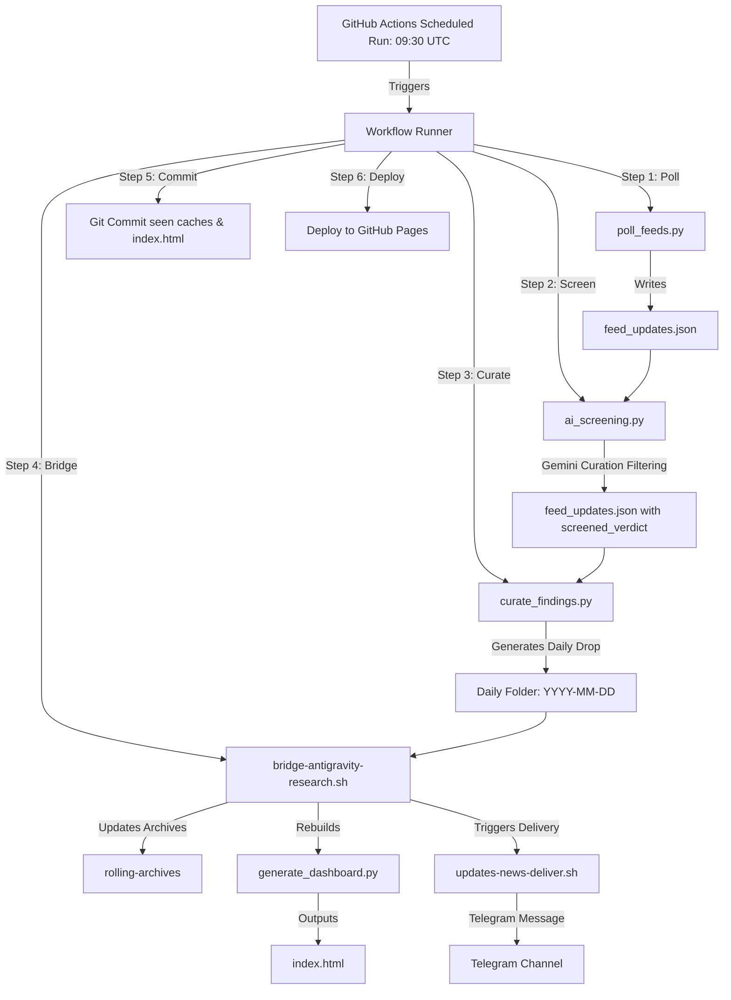

# Technical Handoff: Stack Watch Cloud-Independent Pipeline

**Date:** 2026-06-06  
**Author:** AntiGravity Agent  
**Audience:** External Developer Agents / Operators  
**Workspace Base:** `/Users/user/Projects/Stack Watch`  
**Status:** **CLOUD-READY & COMMITTED** (Local git repository initialized, all scripts decoupled from macOS dependencies, GitHub Action and Curation Agent fully written).

---

## 1. Cloud-Independent Architecture

The pipeline is designed to run completely in a serverless GitHub environment, eliminating any local host (macOS) dependencies.



---

## 2. Dynamic & Cloud-Decoupled Scripts

The core scripts have been modified to run portably on both local macOS (launchd) and Linux cloud VM containers:

### 1. Ingestion Poller ([scripts/poll_feeds.py](file:///Users/user/Projects/Stack%20Watch/scripts/poll_feeds.py))
- Resolves `WORKSPACE_DIR` dynamically relative to the script location.
- Wraps all network fetches (GitHub releases/commits and Hacker News searches) in try-except blocks to prevent timeouts from aborting the run.
- Ensures the dated output directory is created on the fly before writing `feed_updates.json`.

### 2. AI Screening ([scripts/ai_screening.py](file:///Users/user/Projects/Stack%20Watch/scripts/ai_screening.py))
- Queries the macOS Keychain for API keys *only* when running on macOS (`sys.platform == 'darwin'`). Otherwise, relies on environment variables.
- Utilizes **Google Gemini exclusively** (`gemini-2.0-flash-lite`), falling back to a fail-open default (marking all as `keep`) if the API key is missing or calls fail.
- Dynamically locates `LOG_FILE` under macOS logs if present, falling back to a local file in the workspace directory.

### 3. Autonomous Curation ([scripts/curate_findings.py](file:///Users/user/Projects/Stack%20Watch/scripts/curate_findings.py))
- Replaces the manual curation step. It reads feed updates, filters out skipped candidates, loads system rubrics and learnings, and queries Gemini (`gemini-2.0-flash-lite` with structured JSON output) to curate summary, report, findings, and memory entry files directly into the dated daily folder.

### 4. Bridge Processor ([scripts/bridge-antigravity-research.sh](file:///Users/user/Projects/Stack%20Watch/scripts/bridge-antigravity-research.sh))
- Cleans up orphan drops, compiles archives, builds rollups, calls `updates-news-deliver.sh` to Telegram, and triggers `generate_dashboard.py`.
- Features an `rclone` cloud-sync check (falls back to local drive client folders if unconfigured).

---

## 3. GitHub Actions Orchestration

The pipeline is scheduled via [.github/workflows/stack-watch-pipeline.yml](file:///Users/user/Projects/Stack%20Watch/.github/workflows/stack-watch-pipeline.yml):

- **Cron Schedule**: Daily at **09:30 UTC**.
- **Runner Environment**: `ubuntu-latest`
- **Secrets Required**:
  - `GEMINI_API_KEY`: Google Gemini developer API Key.
  - `TELEGRAM_TOKEN_UPDATES`: Telegram bot API token.
  - `TELEGRAM_CHAT_ID`: Telegram channel/chat destination.
- **Git State Commits**: The workflow configures a local git actor, stages updated seen caches (`processed/seen_releases.json`, `_seen-urls.txt`) and the refreshed `index.html` file, and pushes it back to the repository.
- **Pages Deployment**: Uses `actions/deploy-pages` to deploy `index.html` as the live status dashboard.

---

## 4. Operational Diagnostics

### Ingestion Tests
To run polling and screening locally:
```bash
/Users/user/Projects/Stack\ Watch/scripts/run_poller_and_screening.sh
```

### Curation Tests
To run the curation step locally with a dummy key:
```bash
GEMINI_API_KEY=dummy python3 /Users/user/Projects/Stack\ Watch/scripts/curate_findings.py
```
*(Expects: `Gemini Curation call failed: HTTP Error 400: Bad Request`)*

### Bridge & Dashboard compilation
To trigger the bridge manually:
```bash
/Users/user/Projects/Stack\ Watch/scripts/bridge-antigravity-research.sh <date_str>
```

To compile `index.html` manually:
```bash
python3 /Users/user/Projects/Stack\ Watch/scripts/generate_dashboard.py
```

---

## 5. Handover Steps for External Agents

1. **Connect to GitHub Remote**:
   ```bash
   git remote add origin <your-github-repo-url>
   git branch -M main
   git push -u origin main
   ```
2. **Setup Secrets**: Go to your GitHub repository Settings > Secrets and add:
   - `GEMINI_API_KEY`
   - `TELEGRAM_TOKEN_UPDATES`
   - `TELEGRAM_CHAT_ID`
3. **Configure Pages**: Go to settings > Pages and enable Pages deployment from the `gh-pages` branch.
