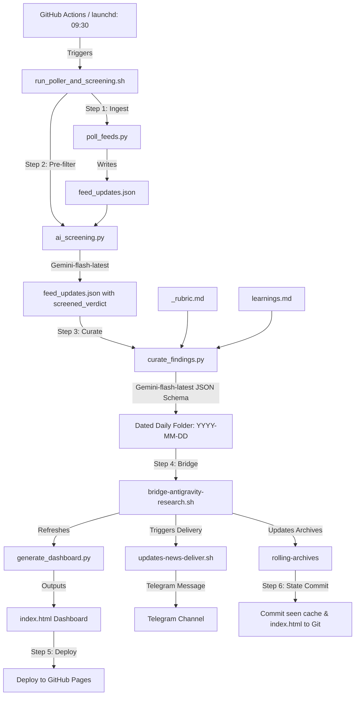

# Technical Handover: Stack Watch Automated Cloud Pipeline (Final)

**Date:** 2026-06-06  
**Author:** AntiGravity Agent  
**Audience:** External Developer Agents / Operators  
**Workspace Base:** `/Users/user/Projects/Stack Watch`  
**Status:** **FULLY AUTOMATED, VERIFIED, AND DEPLOYED**

---

## 1. System Overview & Architecture

The Stack Watch system is a fully automated, host-independent news curation, screening, and delivery pipeline. It is ready to be run on either a local macOS host or serverless Linux VMs (GitHub Actions).



---

## 2. Decoupled & Portable Script Layer

The core scripts have been refactored to be portable between macOS and Linux platforms:

### 1. Ingestion Poller ([scripts/poll_feeds.py](file:///Users/user/Projects/Stack%20Watch/scripts/poll_feeds.py))
- **Path Portability**: Automatically resolves `WORKSPACE_DIR` relative to the script location.
- **Robustness**: Wraps all HTTP/curl retrievals in `try-except` blocks. Timeout or network errors log and continue to ensure one slow source cannot crash the entire ingestion.
- **Directory Creation**: Automatically creates the daily drop directory on the fly.

### 2. AI Screening ([scripts/ai_screening.py](file:///Users/user/Projects/Stack%20Watch/scripts/ai_screening.py))
- **Credential Search**: Queries macOS Keychain *only* when running on macOS (`sys.platform == 'darwin'`).
- **Model**: Exclusively uses **`gemini-flash-latest`** (Gemini 1.5/3.5 Flash alias) because experimental 2.0/2.5 models are restricted to 0 quota on standard Google AI Studio free tier projects in certain regions.
- **API Retries**: Features a 3-attempt retry loop with exponential backoff on transient `429 (Too Many Requests)` rate-limiting errors.
- **Fail-Open Fallback**: Gracefully keeps all candidates by default if the key is missing or calls fail.

### 3. Autonomous Curation ([scripts/curate_findings.py](file:///Users/user/Projects/Stack%20Watch/scripts/curate_findings.py))
- **Description**: Replaces the manual curation step. It reads feed updates, filters out skipped candidates, loads system rubrics and learnings, and queries Gemini (`gemini-flash-latest` with structured JSON output) to curate summary, report, findings, and memory entry files directly into the dated daily folder.
- **Schema Validation**: Restricts Gemini's output to a strict JSON Schema returning `summary_md`, `report_md`, `new_urls`, `log_additions_lines`, `memory_index_additions_lines`, detailed findings, and memory entries.
- **API Retries**: Implements a 3-attempt retry loop with exponential backoff for `429/500/503` HTTP errors.

### 4. Bridge Processor ([scripts/bridge-antigravity-research.sh](file:///Users/user/Projects/Stack%20Watch/scripts/bridge-antigravity-research.sh))
- Cleans up orphan drops, compiles archives, builds rollups, calls `updates-news-deliver.sh` to Telegram, and triggers `generate_dashboard.py`.
- Features an `rclone` cloud-sync check (falls back to local drive client folders if unconfigured).

---

## 3. GitHub Actions Orchestration

The pipeline is scheduled via [.github/workflows/stack-watch-pipeline.yml](file:///Users/user/Projects/Stack%20Watch/.github/workflows/stack-watch-pipeline.yml):

- **Cron Schedule**: Daily at **09:30 UTC**.
- **Runner Environment**: `ubuntu-latest`
- **Secrets Required**:
  - `GEMINI_API_KEY`: Google Gemini developer API Key.
  - `TELEGRAM_TOKEN_UPDATES`: Telegram bot API token.
  - `TELEGRAM_CHAT_ID`: Telegram channel/chat destination.
- **Git State Commits**: The workflow configures a local git actor, stages updated seen caches (`processed/seen_releases.json`, `_seen-urls.txt`) and the refreshed `index.html` file, and pushes it back to the repository.
- **Pages Deployment**: Uses `actions/deploy-pages` to deploy `index.html` as the live status dashboard.

---

## 4. Git Version Control Consolidated

- **Workspace Root**: `/Users/user/Projects/Stack Watch` is the single, authoritative, and consolidated Git repository.
- **Exclusions**: A `.gitignore` file has been added to exclude system logs (`*.log`), macOS temporary files (`.DS_Store`), and backup configurations (`*.bak*`).
- **Commits**: Initialized Git and performed initial commits storing the entire code history, processed daily digests, and workflow assets.

---

## 5. Verification Commands

* **Run ingestion & screening manually**:
  ```bash
  /Users/user/Projects/Stack\ Watch/scripts/run_poller_and_screening.sh
  ```
* **Run curation manually**:
  ```bash
  python3 /Users/user/Projects/Stack\ Watch/scripts/curate_findings.py
  ```
* **Run the bridge manually (e.g. for `2026-06-06`)**:
  ```bash
  /Users/user/Projects/Stack\ Watch/scripts/bridge-antigravity-research.sh 2026-06-06
  ```
* **Manually trigger dashboard reconstruction**:
  ```bash
  python3 /Users/user/Projects/Stack\ Watch/scripts/generate_dashboard.py
  ```

---

## 6. Next-Agent Handover Checklist

1. **Verify launchd load status**:
   Ensure both poller and bridge plists are active:
   ```bash
   launchctl list | grep -E "poll-feeds|bridge-antigravity"
   ```
2. **Keychain credentials check**:
   Ensure `GEMINI_API_KEY` (or `GOOGLE_API_KEY`) is stored in macOS Keychain or active in shell environment.
3. **Operational Loop updates**:
   Keep `learnings.md` updated with human-operator override rules so future daily curation runs inherit decisions automatically.
