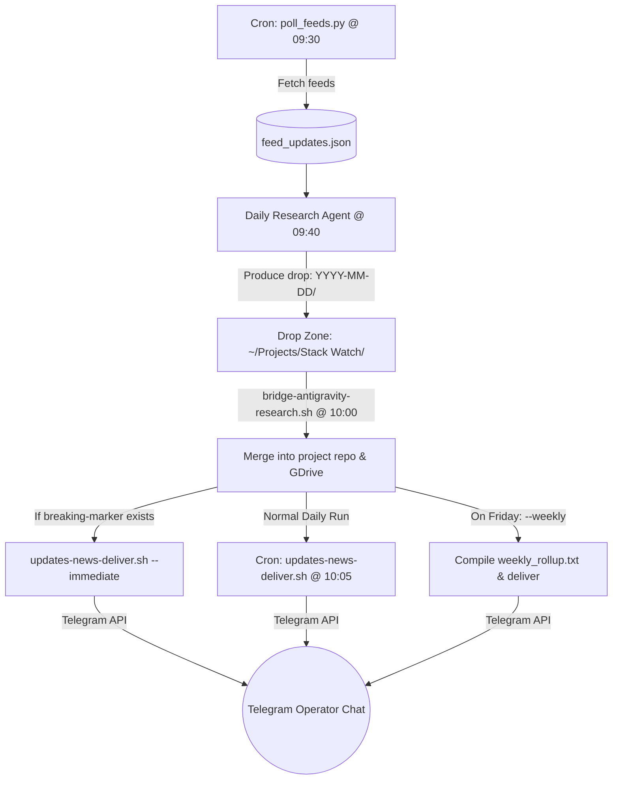

# Handoff: Stack Watch News System (AntiGravity & Hermes Integration)

**Date:** 2026-06-05  
**System Scope:** End-to-end news system consisting of the Daily Research Poller & Producer (AntiGravity), the Bridge script (`bridge-antigravity-research.sh`), and the Hermes Delivery Bot (`updates-news-deliver.sh`).  
**Status:** **LIVE** and verified. Complete implementation of Phases 0-5.

---

## 1. System Architecture & Component Roles

The system operates in a deterministic, stateless, and secure daily cycle:



### 1.1 Poller & Producer (Daily Research Layer)
* **Script:** [poll_feeds.py](file:///Users/user/Projects/Stack%20Watch/scripts/poll_feeds.py)
  * Runs via cron at **09:30**.
  * Collects updates from GitHub Releases (Ollama, Claude Code, Mem0, tmux, iTerm2, OpenClaw), GitHub Commits (MCP Servers registry), and Hacker News Algolia query search.
  * Uses `seen_releases.json` to dedup by `(component, version)`.
  * Outputs to `/Users/user/Projects/Stack Watch/YYYY-MM-DD/feed_updates.json`.
* **Rubric Instructions**: Located at [_rubric.md](file:///Users/user/Projects/Stack%20Watch/_rubric.md). Instructs the Daily Research Agent to:
  * Read `feed_updates.json` as the primary source of truth.
  * Write Russian titles and summaries for findings.
  * Assign a `**Severity:**` tag (`breaking/security` 🚨, `performance` ⚡, `integration` 🧩, `minor`) and `**Tags:**` field.
  * Create a `breaking-marker` file in the daily drop zone if a `breaking/security` finding is added.

### 1.2 Bridge Layer
* **Script:** [bridge-antigravity-research.sh](file:///Users/user/Projects/Stack%20Watch/scripts/bridge-antigravity-research.sh)
  * Runs via cron at **10:00** (after research drops are ready).
  * Cleans up orphan drop zones older than 3 days missing `REPORT.md`.
  * Copies findings to repo and Google Drive (component specific archive folders, daily-digest, general summaries).
  * **Immediate Alert Routing**: If `breaking-marker` exists, runs `updates-news-deliver.sh --immediate --date YYYY-MM-DD`.
  * **Weekly Rollup Compiler**: When executed with the `--weekly` flag (e.g. Fridays), compiles the last 7 days of summaries into [weekly_rollup.txt](file:///Users/user/Projects/Stack%20Watch/processed/weekly_rollup.txt) (filtering out empty/none sections via stateful, CRLF-robust `awk`) and immediately fires the delivery bot with the `--weekly-rollup` flag.

### 1.3 Delivery Layer (Hermes Bot)
* **Script:** [updates-news-deliver.sh](file:///Users/user/Projects/Stack%20Watch/scripts/updates-news-deliver.sh)
  * Runs via cron at **10:05** for standard daily updates.
  * **Reliability Loop**: Handles Telegram API communication. Retries up to 3 times with exponential backoff on transient network failures.
  * **Header & Stats Parsing**: Parses `By verdict` metadata from `summary.md` and appends stats to the message header, e.g. `[Do-Now: 0 | Exp: 2 | Park: 2]`.
  * **Thematic Layer Grouping**: Sorts findings by verdict (Do now, Experiment, Parking) × thematic layer (AI Agents & LLMs, Local Dev, System Memory & CLI, Other).
  * **Severity Emojis**: Prefixes findings with emojis according to their severity (`breaking/security` 🚨, `performance` ⚡, `integration` 🧩, `minor` •). Collapses `minor` updates into a single concise dry block.
  * **Telegram Chunking**: Splits messages exceeding 4000 characters cleanly on line boundaries.
  * **Detail Documents Attachment**: Automatically calls `sendDocument` to attach the detailed findings (`external-research/<slug>.md`) in the chat.
  * **Weekly Rollup Delivery**: Reads `weekly_rollup.txt` directly, bypassing daily summary files and the daily sent-state, and records delivery to `updates-weekly-sent.txt`.

---

## 2. Key Facts & Paths (Copy-Paste Reference)

| Item | Value / Path |
|---|---|
| Telegram Bot Name / ID | `@bgvnupdate_bot` (id `8943529536`) |
| Bot Token Storage | macOS **Keychain** (service `TELEGRAM_TOKEN_UPDATES`, account `hermes`) |
| Target Chat ID | `7656475139` (override via env `TELEGRAM_HOME_CHANNEL`) |
| Daily Polling Script | `~/Projects/Stack Watch/scripts/poll_feeds.py` |
| Bridge Script | `~/Projects/Stack Watch/scripts/bridge-antigravity-research.sh` |
| Delivery Script | `~/Projects/Stack Watch/scripts/updates-news-deliver.sh` |
| Cron Schedule: Poller | `30 9 * * *` (09:30 local) |
| Cron Schedule: Bridge | `0 10 * * *` (10:00 local) |
| Cron Schedule: Delivery | `5 10 * * *` (10:05 local) |
| Cron Runner Store | `~/.hermes/cron/jobs.json` |
| Daily Idempotency State | `~/.hermes/state/updates-last-sent.txt` |
| Immediate Idempotency State | `~/.hermes/state/updates-immediate-sent.txt` |
| Weekly Idempotency State | `~/.hermes/state/updates-weekly-sent.txt` |
| Bridge Log File | `~/Library/Logs/bridge-antigravity-research.log` |

Read the token from the shell:
```bash
security find-generic-password -a hermes -s TELEGRAM_TOKEN_UPDATES -w
```

---

## 3. Input & Output Contracts

### 3.1 Input Formats
* **`feed_updates.json`**: An array of JSON objects containing `"title"`, `"url"`, `"date"`, `"component"`, `"version"`, and `"type"`.
* **Daily summaries (`YYYY-MM-DD-stack-watch.md`)**: Must contain `## Do now (high confidence)`, `## Experiment`, and `## Parking` headers. Individual findings must match: `- <slug> — <title>` (em-dash separator).
* **Finding notes (`external-research/<slug>.md`)**: Grepped for metadata tags:
  ```markdown
  **Original URL:** https://example.com
  **Touches:** Ollama, iTerm2
  **Severity:** breaking/security
  **Tags:** driver, crash
  ```

### 3.2 Telegram Message Formatting
Messages are formatted in HTML:
```html
📰 <b>Stack Watch — 2026-06-05</b> [do-now 0, experiment 1, parking 2, skip 3]

<b>Эксперименты (Experiment):</b>
🤖 <b>AI Agents & LLMs:</b>
  ⚡ <b>Audit ChatGPT memory summary after Dreaming V3 rollout</b> (ChatGPT) — <a href="https://example.com">источник</a>
```

---

## 4. Run / Operation Commands

### 4.1 Daily Update Flow
```bash
# Preview today's daily message in the console
~/Projects/Stack Watch/scripts/updates-news-deliver.sh --dry-run

# Force re-send today's daily digest even if already sent
~/Projects/Stack Watch/scripts/updates-news-deliver.sh --force

# Force send updates for a specific date
~/Projects/Stack Watch/scripts/updates-news-deliver.sh --date 2026-06-04 --force
```

### 4.2 Weekly Rollup Flow
```bash
# Compile the last 7 days and send the weekly rollup to Telegram
"~/Projects/Stack Watch/scripts/bridge-antigravity-research.sh" --weekly

# Dry-run weekly rollup delivery
~/Projects/Stack Watch/scripts/updates-news-deliver.sh --weekly-rollup "~/Projects/Stack Watch/processed/weekly_rollup.txt" --dry-run
```

### 4.3 Cron Management (via Hermes CLI)
```bash
# Check if the scheduler is running
hermes cron status

# List all scheduled jobs and next runs
hermes cron list

# Manually trigger a job immediately
hermes cron run u9d4tb5wsd01
```

---

## 5. System Checklist (Operation & Maintenance)

1. **Verify Token Resolution**: Running `security find-generic-password -a hermes -s TELEGRAM_TOKEN_UPDATES -w` must print the token, and `curl -s "https://api.telegram.org/bot<token>/getMe"` must return `{"ok":true}`.
2. **Log Rotations**: The bridge script logs to `~/Library/Logs/bridge-antigravity-research.log`. Monitor this log for errors or alert warnings.
3. **No Network Dependency in Poller**: The Python poller uses native OS commands (`curl`) wrapped in `subprocess` to fetch updates. Ensure target URLs are reachable.
4. **Idempotency Guard**: If testing, manually clear dates from `~/.hermes/state/updates-last-sent.txt`, `updates-immediate-sent.txt`, or `updates-weekly-sent.txt` as needed to allow re-sends.
